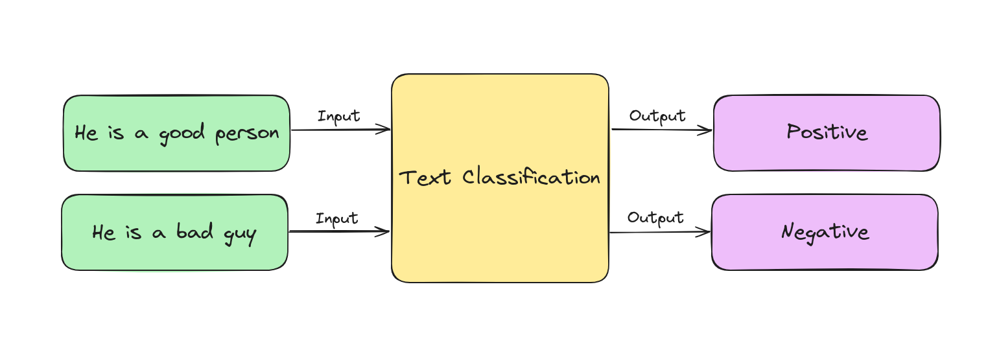
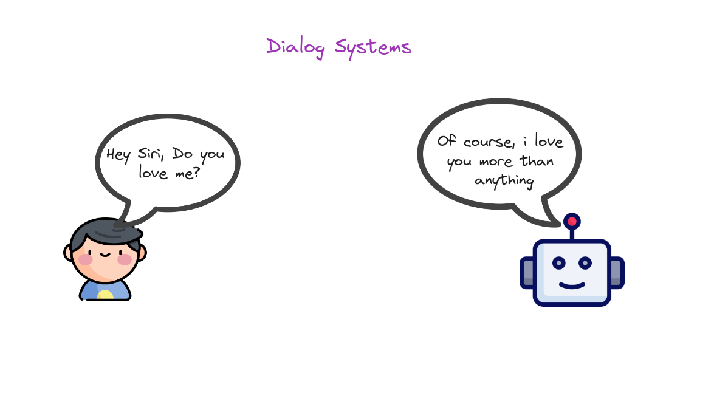
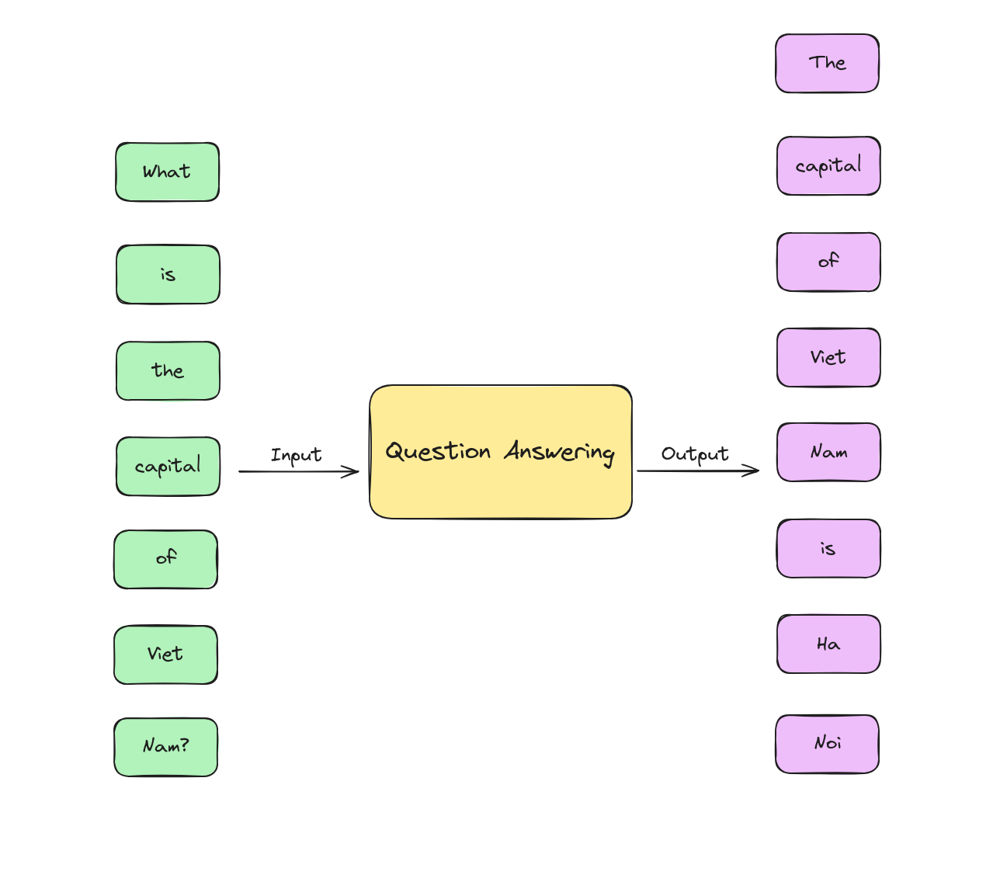

# Xử lý Ngôn ngữ Tự nhiên

## Giới thiệu

Xử lý Ngôn ngữ Tự nhiên đóng vai trò quan trọng trong nhiều ứng dụng phần mềm hàng ngày. Một số ví dụ tiêu biểu:

1. **Nền tảng Email**: Các dịch vụ như Gmail và Outlook sử dụng NLP để phân loại thư rác, ưu tiên hộp thư đến và tính năng tự động hoàn thành.
2. **Trợ lý giọng nói**: Apple Siri, Google Assistant, Microsoft Cortana và Amazon Alexa dựa vào NLP để tương tác với người dùng và phản hồi lệnh.
3. **Công cụ tìm kiếm**: Google và Bing sử dụng NLP để hiểu truy vấn, truy xuất thông tin và xếp hạng kết quả.
4. **Dịch máy**: Google Translate và Amazon Translate áp dụng NLP để hỗ trợ giao tiếp và giải quyết các tình huống kinh doanh.

Bên cạnh đó, còn có nhiều ứng dụng khác của NLP:

1. Phân tích mạng xã hội: Các tổ chức phân tích mạng xã hội để hiểu cảm xúc của khách hàng.
2. Thương mại điện tử: NLP trích xuất thông tin từ mô tả sản phẩm và hiểu đánh giá của người dùng.
3. Công cụ kiểm tra chính tả và ngữ pháp: Các công cụ như Grammarly và kiểm tra chính tả trong trình xử lý văn bản dựa vào NLP.

Danh sách này chưa đầy đủ, vì NLP vẫn đang mở rộng sang nhiều ứng dụng mới. Mục tiêu chính là giới thiệu các khái niệm đằng sau việc xây dựng các ứng dụng này thông qua việc thảo luận các vấn đề và giải pháp trong NLP.

## NLP

Trong nhiều dự án NLP, có một số nhiệm vụ cơ bản thường xuyên xuất hiện. Những nhiệm vụ này đã được nghiên cứu kỹ lưỡng vì chúng quan trọng và phổ biến. Nếu hiểu rõ chúng, chúng ta sẽ sẵn sàng xây dựng các ứng dụng NLP cho nhiều lĩnh vực khác nhau. Hãy cùng điểm qua các nhiệm vụ này.

### Mô hình hóa ngôn ngữ

Nhiệm vụ này liên quan đến việc ***dự đoán*** từ tiếp theo trong một câu dựa vào các từ đứng trước từ cần được dự đoán. Mục tiêu là tìm ra xác suất xuất hiện của các chuỗi từ trong một ngôn ngữ. Nó hữu ích cho nhiều ứng dụng như nhận diện giọng nói, dịch thuật và sửa lỗi chính tả.

### Phân loại văn bản

Đây là nhiệm vụ liên quan đến việc phân loại văn bản vào các nhóm đã xác định dựa trên nội dung của nó. Là một trong những ứng dụng phổ biến của NLP, ví dụ như nhận diện email rác và phân tích cảm xúc.

### Trích xuất thông tin

Nhiệm vụ này nhằm lấy ra các thông tin hữu ích từ văn bản, ví dụ như xác định sự kiện trong email hoặc nhận diện tên người trong các bài đăng mạng xã hội. Một trong những nhiệm vụ phổ biến nhất của trích xuất thông tin là Nhận diện Thực thể có tên (NER).

### Tác nhân hội thoại

Nhiệm vụ này liên quan đến việc xây dựng các hệ thống có khả năng giao tiếp bằng ngôn ngữ tự nhiên, ví dụ như các ứng dụng phổ biến Alexa và Siri.

### Tóm tắt văn bản

Nhiệm vụ này tập trung vào việc tạo ra bản tóm tắt ngắn gọn cho các tài liệu dài mà vẫn giữ được nội dung và thông điệp chính.

### Hệ thống trả lời câu hỏi

Nhiệm vụ này liên quan đến việc xây dựng hệ thống có khả năng tự động trả lời các câu hỏi được đặt ra bằng ngôn ngữ tự nhiên.

### Dịch máy

Nhiệm vụ này liên quan đến việc dịch văn bản từ ngôn ngữ này sang ngôn ngữ khác, với các công cụ như Google Translate là ví dụ điển hình.

## Ngôn ngữ là gì?

Ngôn ngữ là một hệ thống giao tiếp phức tạp, được cấu trúc từ các thành phần như ký tự, từ và câu. Ngôn ngữ học – ngành nghiên cứu về ngôn ngữ – cung cấp những hiểu biết quan trọng để hiểu về NLP. Trong phần này, chúng ta sẽ khám phá các khái niệm ngôn ngữ học then chốt và sự liên quan của chúng đến các nhiệm vụ NLP. Ngôn ngữ con người bao gồm âm vị, hình vị, từ vị, cú pháp và ngữ cảnh. Các ứng dụng NLP dựa vào việc hiểu các yếu tố này, từ đơn vị âm thanh cơ bản đến các biểu đạt có ý nghĩa trong ngữ cảnh.

Ngôn ngữ học là lĩnh vực nghiên cứu về ngôn ngữ và rất rộng lớn, ở đây chúng ta chỉ giới thiệu một số ý tưởng cơ bản để minh họa vai trò của kiến thức ngôn ngữ học trong NLP.

### Âm vị (Phoneme)
Âm vị là đơn vị âm thanh nhỏ nhất trong một ngôn ngữ, bản thân chúng không mang ý nghĩa nhưng khi kết hợp lại sẽ tạo thành từ có nghĩa. Tiếng Anh có 44 âm vị. Bảng dưới đây minh họa các âm vị này cùng ví dụ (trích từ sách **Practical Natural Language Processing**).

Âm vị rất quan trọng cho các ứng dụng như nhận diện giọng nói, chuyển giọng nói thành văn bản và chuyển văn bản thành giọng nói.

### Hình vị và từ vị (Morpheme & Lexeme)

#### Hình vị (Morpheme)
Hình vị là đơn vị nhỏ nhất mang ý nghĩa trong ngôn ngữ, được tạo thành từ các âm vị. Không phải tất cả hình vị đều là từ, nhưng mọi tiền tố và hậu tố đều là hình vị. Ví dụ, trong từ "multimedia", "multi-" là tiền tố và là một hình vị bổ nghĩa cho "media".

#### Từ vị (Lexeme)
Từ vị là các biến thể của hình vị có chung một ý nghĩa, ví dụ "run" và "running". Phân tích hình thái học nghiên cứu các cấu trúc này, là nền tảng cho nhiều nhiệm vụ NLP như tách từ, rút gọn từ, học biểu diễn từ và gán nhãn từ loại.

### Cú pháp (Syntax)
Cú pháp là tập hợp các quy tắc để xây dựng câu đúng ngữ pháp từ các từ và cụm từ. Cú pháp thường được biểu diễn bằng cây phân tích cú pháp như hình dưới đây.

### Ngữ cảnh (Context)
Ngữ cảnh là cách các thành phần của ngôn ngữ kết hợp với nhau để truyền đạt ý nghĩa, bao gồm tham chiếu dài hạn, kiến thức thế giới và kiến thức thông thường, vượt ra ngoài nghĩa đen của từ. Ý nghĩa của một câu có thể thay đổi tùy vào ngữ cảnh vì từ và cụm từ có thể đa nghĩa, như ví dụ "Old Man" dưới đây. Ngữ cảnh bao gồm ngữ nghĩa (ý nghĩa trực tiếp của từ và câu) và ngữ dụng (bổ sung ngữ cảnh bên ngoài và kiến thức thế giới). Các nhiệm vụ NLP phức tạp như phát hiện mỉa mai và tóm tắt văn bản phụ thuộc nhiều vào việc hiểu ngữ cảnh.

## Thách thức của NLP
NLP là lĩnh vực đầy thách thức do sự mơ hồ và tính sáng tạo của ngôn ngữ con người. Chúng ta sẽ tìm hiểu các đặc điểm này, bắt đầu từ sự mơ hồ của ngôn ngữ.

### Sự mơ hồ (Ambiguity)
Sự mơ hồ là sự không rõ ràng về ý nghĩa trong ngôn ngữ. Ví dụ, câu "Give me a bat" không rõ "bat" là con dơi hay cây gậy bóng chày. Chỉ nhìn vào từ thì không đủ thông tin để xác định ý nghĩa, do đó cần biết ngữ cảnh sử dụng. Ý nghĩa phụ thuộc vào ngữ cảnh: trong câu chuyện giữa các nhà nghiên cứu động vật, "bat" là con dơi, còn trong bối cảnh thể thao, "bat" là cây gậy bóng chày.

### Kiến thức chung (Common knowledge)
Một phần quan trọng của ngôn ngữ là "kiến thức chung", tức là những sự thật mà hầu hết mọi người đều biết. Kiến thức này được ngầm hiểu trong giao tiếp và ảnh hưởng đến ý nghĩa câu nói mà không cần nêu rõ. Ví dụ, "man bit dog" (người cắn chó) là điều hiếm gặp, còn "dog bit man" (chó cắn người) thì hợp lý hơn vì chúng ta biết con người hiếm khi cắn chó, còn chó thường cắn người. Kiến thức chung này giúp con người hiểu ngôn ngữ, nhưng máy tính lại gặp khó khăn vì thiếu sự hiểu ngầm này. Một thách thức lớn của NLP là mã hóa kiến thức chung của con người vào mô hình máy tính.

### Sự sáng tạo (Creativity)
Ngôn ngữ không chỉ tuân theo các quy tắc mà còn chứa đựng sự sáng tạo, thể hiện qua phong cách, phương ngữ, thể loại và các biến thể. Thơ ca là ví dụ điển hình cho sự sáng tạo này. Việc hiểu được sự sáng tạo trong ngôn ngữ là một thách thức lớn đối với cả NLP và AI nói chung.

### Sự đa dạng giữa các ngôn ngữ
Hầu hết các ngôn ngữ không có sự tương ứng trực tiếp về từ vựng với nhau, khiến việc chuyển giao giải pháp NLP giữa các ngôn ngữ trở nên khó khăn. Một giải pháp hiệu quả cho ngôn ngữ này có thể không phù hợp với ngôn ngữ khác. Điều này đòi hỏi hoặc phải xây dựng giải pháp không phụ thuộc vào ngôn ngữ (rất khó), hoặc phát triển riêng cho từng ngôn ngữ (tốn thời gian và công sức).

NLP là lĩnh vực đầy thách thức nhưng cũng rất thú vị và bổ ích.

## Kết luận

Trong bài học này, ta đã tìm hiểu các ứng dụng thực tế của Xử lý Ngôn ngữ Tự nhiên (NLP). Chúng ta đã khám phá cách NLP thúc đẩy các công nghệ như chatbot, phân tích cảm xúc và dịch ngôn ngữ. Hiểu được các ứng dụng này giúp chúng ta nhận thấy tác động của NLP đến cuộc sống hàng ngày và tiềm năng giải quyết các vấn đề phức tạp của nó.

## Tài liệu tham khảo

+ Sowmya Vajjala, Bodhisattwa Majumder, Anuj Gupta, and Harshit Surana, Practical natural language processing : a comprehensive guide to building real-world NLP sysems. Sebastopol, Ca O’reilly Media, 2020.
+ IBM, “What is Natural Language Processing?,” IBM, 2023. https://www.ibm.com/topics/natural-language-processing
+ Coursera Staff, “What is Natural Language Processing? Definition and Examples,” Coursera, Jun. 16, 2023. https://www.coursera.org/articles/natural-language-processing