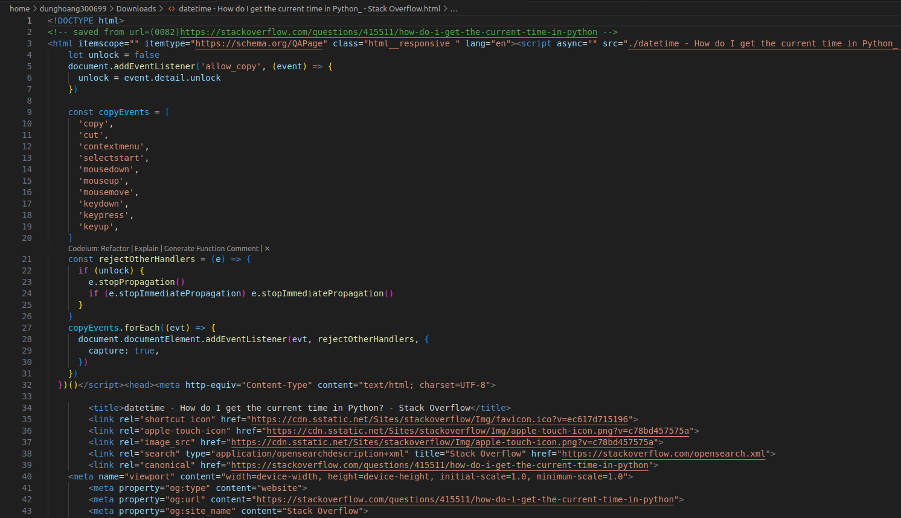
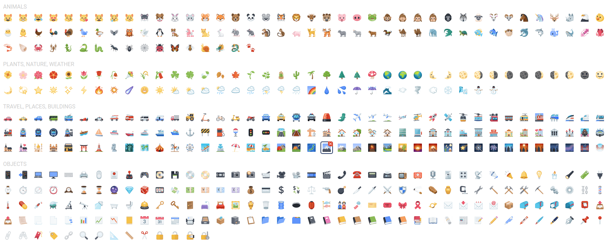

# Trích xuất và làm sạch văn bản (Text Extraction and Cleanup)
Chúng ta đã thảo luận một số kỹ thuật làm sạch văn bản thô trong quy trình NLP Pipeline, nhưng cần nhấn mạnh rằng bước này cực kỳ quan trọng vì "rác vào thì rác ra" (garbage in, garbage out). Do đó, chúng ta sẽ đi sâu hơn vào bước này và khám phá các phương pháp phổ biến để làm sạch văn bản.

Trích xuất và làm sạch văn bản liên quan đến việc loại bỏ thông tin không phải văn bản như markup (thẻ đánh dấu) và metadata (siêu dữ liệu) khỏi văn bản thô và chuyển đổi nó sang định dạng cần thiết. Quá trình này thay đổi tùy theo định dạng dữ liệu, ví dụ như PDF, HTML hoặc các luồng dữ liệu liên tục. Ví dụ, định dạng dữ liệu HTML như hình dưới đây.




## Phân tích và làm sạch HTML (HTML Parsing and Cleanup)
Giả sử chúng ta đang xây dựng một công cụ tìm kiếm diễn đàn cho các câu hỏi lập trình, sử dụng Stack Overflow làm nguồn dữ liệu. Để trích xuất các cặp câu hỏi và trả lời, ta có thể tận dụng các thẻ HTML đặc trưng cho câu hỏi và trả lời trên trang. Thay vì tự viết trình phân tích HTML, ta có thể dùng các thư viện như Beautiful Soup và Scrapy. Dưới đây là ví dụ sử dụng Beautiful Soup để trích xuất cặp câu hỏi và trả lời từ một trang Stack Overflow.

```python
from bs4 import BeautifulSoup
from urllib.request import urlopen, Request
import requests
myurl = "https://stackoverflow.com/questions/415511/how-to-get-the-current-time-in-python"
req = Request(myurl, headers={'User-Agent' : "Magic Browser"}) 
html = urlopen(req).read()
soupified = BeautifulSoup(html, "html.parser")
question = soupified.find("div", {"id": "question-header"})
questiontext = question.find("a", {"class": "question-hyperlink"})
print("Question: \n", questiontext.get_text().strip())
answer = soupified.find("div", {"class": "answercell post-layout--right"})
answertext = answer.find("div", {"class": "s-prose js-post-body"})
print("Best answer: \n", answertext.get_text().strip())
```


Chúng ta sử dụng hiểu biết về cấu trúc HTML để trích xuất thông tin cần thiết. Đoạn mã trên sẽ cho ra kết quả như sau:

```python
Question: 
 How do I get the current time in Python?
Best answer: 
 Use datetime:
>>> import datetime
>>> now = datetime.datetime.now()
>>> now
datetime.datetime(2009, 1, 6, 15, 8, 24, 78915)
>>> print(now)
2009-01-06 15:08:24.789150

For just the clock time without the date:
>>> now.time()
datetime.time(15, 8, 24, 78915)
>>> print(now.time())
15:08:24.789150


To save typing, you can import the datetime object from the datetime module:
>>> from datetime import datetime

Then remove the prefix datetime. from all of the above.
```


Trong ví dụ này, chúng ta cần trích xuất một cặp câu hỏi và trả lời cụ thể. Với các tác vụ khác, như trích xuất địa chỉ từ trang web, ta có thể lấy toàn bộ văn bản từ trang. Các thư viện HTML thường có hàm loại bỏ thẻ HTML và trả về nội dung văn bản. Tuy nhiên, điều này có thể tạo ra kết quả nhiễu, bao gồm cả JavaScript không mong muốn. Để tránh điều này, nên trích xuất nội dung từ các thẻ thường chứa văn bản.


## Chuẩn hóa Unicode (Unicode Normalization)
Khi làm sạch các thẻ HTML trong mã, chúng ta có thể gặp nhiều ký tự Unicode khác nhau, như ký hiệu và emoji.



Hình trên minh họa một số ví dụ về các ký tự này.

Để xử lý các ký hiệu không phải văn bản và ký tự đặc biệt, ta sử dụng chuẩn hóa Unicode (Unicode normalization), chuyển văn bản hiển thị thành định dạng nhị phân để lưu trữ, gọi là mã hóa văn bản (text encoding). Nếu bỏ qua mã hóa, có thể gây lỗi xử lý ở các bước sau của pipeline.

Các hệ điều hành khác nhau có các kiểu mã hóa mặc định khác nhau. Khi xử lý văn bản đa ngôn ngữ hoặc từ mạng xã hội, thường cần chuyển đổi giữa các kiểu mã hóa này trong quá trình trích xuất văn bản. Dưới đây là ví dụ xử lý Unicode:

```python
text = "I love 🍕 ! Shall we book a 🚙 to pizza?"
text = text.encode("utf-8")
print(text)
```

which outputs:

```python
b'I love \xf0\x9f\x8d\x95 ! Shall we book a \xf0\x9f\x9a\x99 to pizza?'
```


Văn bản sau xử lý giờ đã ở dạng máy tính có thể đọc được và sẵn sàng cho các bước tiếp theo trong pipeline.


## Biểu thức chính quy (Regex - Regular Expression)
Biểu thức chính quy (Regex) là công cụ hữu ích để nhận diện các mẫu (pattern) cụ thể trong chuỗi văn bản. Ví dụ, nếu dữ liệu chứa số điện thoại, email hoặc URL, ta có thể nhận diện chúng bằng Regex. Ta có thể linh hoạt quyết định giữ lại hay loại bỏ các mẫu văn bản này tùy theo yêu cầu. Dưới đây là ví dụ sử dụng Regex để trích xuất nội dung hữu ích.

```python
import re 
text = """<Hello everyone>  
#Let's learning together with Robusto AI
url <https://nami.ai/>,  
email <dunghoang@gmail.com> 
"""
def clean_text(text): 
    # remove HTML TAG 
    html = re.compile('[<,#*?>]') 
    text = html.sub(r'',text) 
    # Remove urls: 
    url = re.compile('url https?://\S+|www\.S+') 
    text = url.sub(r'',text) 
    # Remove email id: 
    email = re.compile('email [A-Za-z0-2]+@[\w]+.[\w]+') 
    text = email.sub(r'',text) 
    return text 
print(clean_text(text))
```

which outputs:

```python
Hello everyone  
Let's learning together with Robusto AI
```


Văn bản sau xử lý giờ chỉ còn lại thông tin cần thiết.


## Sửa lỗi chính tả (Spelling Correction)
Trong môi trường số hiện đại, lỗi chính tả rất phổ biến do gõ nhanh hoặc bấm nhầm phím. Vấn đề này xuất hiện ở nhiều nền tảng như công cụ tìm kiếm, chatbot trên điện thoại, mạng xã hội... Dù đã xử lý thẻ HTML và ký tự Unicode, lỗi chính tả vẫn là một thách thức riêng, có thể ảnh hưởng đến khả năng hiểu ngôn ngữ của dữ liệu. Ngoài ra, ngôn ngữ viết tắt trên mạng xã hội cũng làm phức tạp việc xử lý và hiểu ngữ cảnh.

Ngôn ngữ viết tắt thường dùng trong giao diện chat, còn lỗi gõ nhầm (fat-finger problems) lại phổ biến ở công cụ tìm kiếm. Dù đã nhận diện vấn đề này, hiện chưa có giải pháp hoàn hảo. Tuy nhiên, có thể giảm thiểu tác động của nó. Microsoft đã cung cấp REST API hỗ trợ kiểm tra chính tả, có thể truy cập bằng Python.

**Lưu ý:** Để biết thêm chi tiết, hãy xem [**hướng dẫn của Microsoft**](https://learn.microsoft.com/en-us/previous-versions/azure/cognitive-services/Bing-Spell-Check/quickstarts/python).


## Kết luận

Trong bài học này, chúng ta tập trung vào làm sạch văn bản, một bước quan trọng trong quy trình NLP pipeline. Chúng ta đã học cách phân tích HTML khi thu thập văn bản từ Internet, xử lý lỗi chính tả, chuẩn hóa văn bản và sử dụng regex để trích xuất thông tin giá trị. Làm sạch văn bản đúng cách giúp dữ liệu chính xác, sẵn sàng cho phân tích và nâng cao hiệu quả mô hình.


## Tài liệu tham khảo

+ Sowmya Vajjala, Bodhisattwa Majumder, Anuj Gupta, and Harshit Surana, Practical natural language processing : a comprehensive guide to building real-world NLP sysems. Sebastopol, Ca O’reilly Media, 2020.
+ “Text Cleaning for NLP: A Tutorial,” MonkeyLearn Blog, May 31, 2021. https://monkeylearn.com/blog/text-cleaning/


