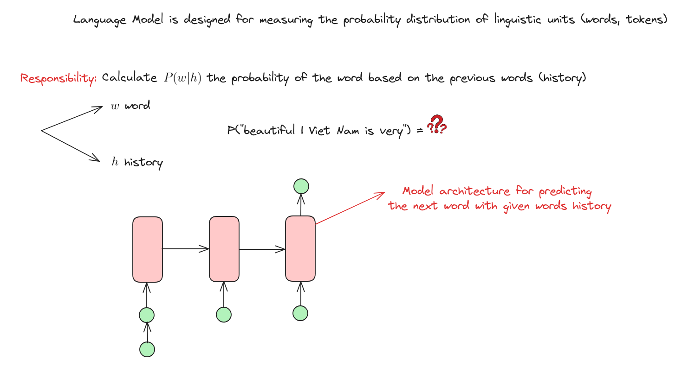
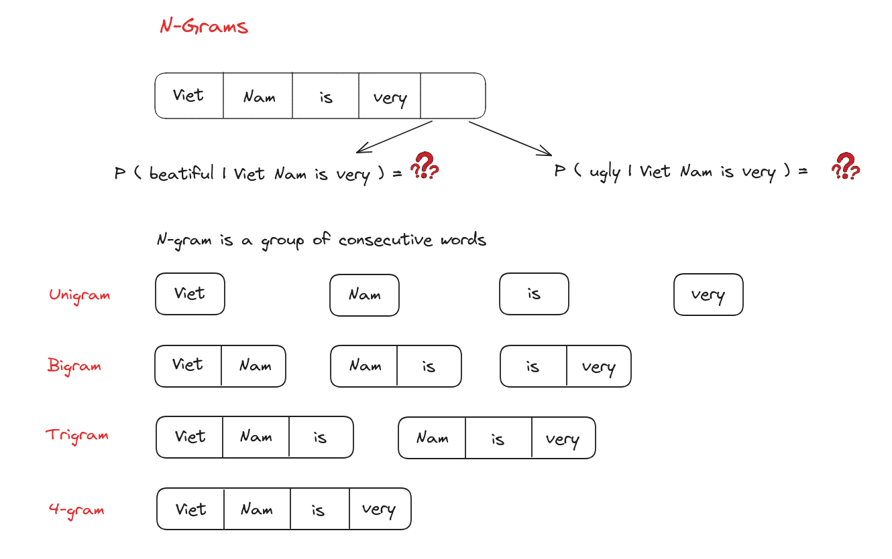
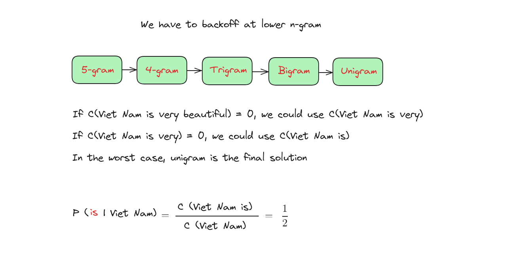
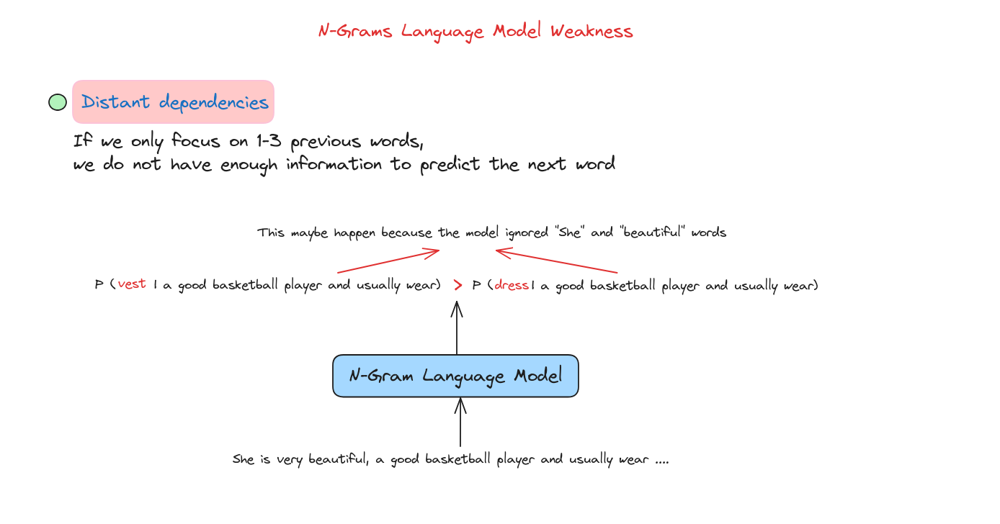
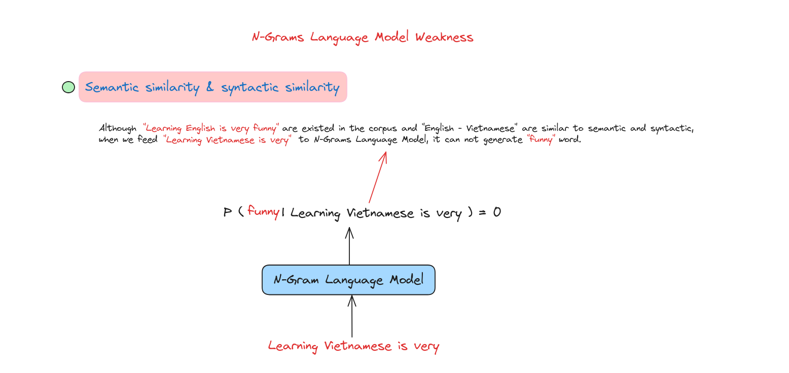
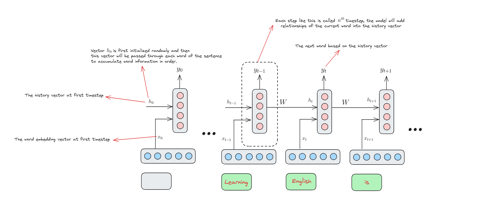
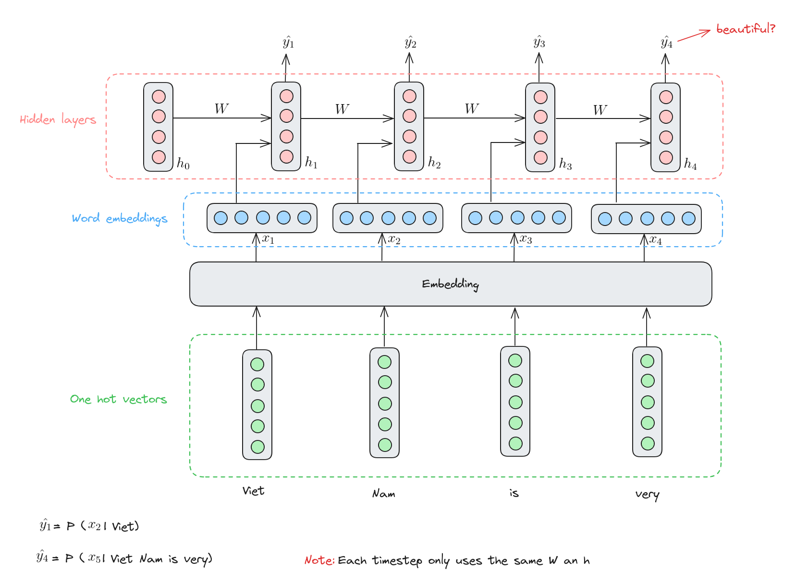
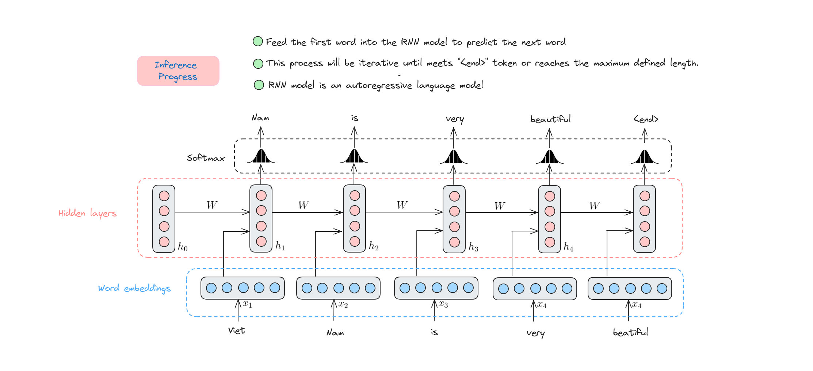
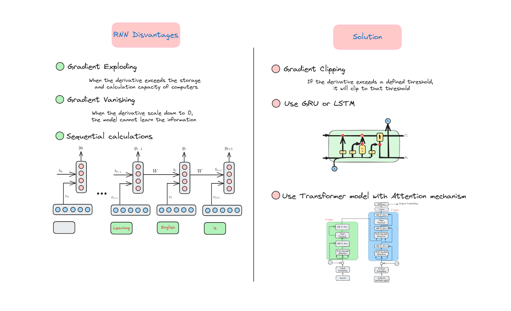

# Recurrent Neural Network


## Giới thiệu (Introduction)

Recurrent Neural Network (RNN - Mạng nơ-ron hồi tiếp) là một loại mạng nơ-ron được thiết kế để xử lý dữ liệu dạng chuỗi, như chuỗi thời gian, ngôn ngữ, hoặc khung hình video. Khác với mạng nơ-ron truyền thống, RNN có các kết nối vòng lặp (loop back) cho phép nó "ghi nhớ" các đầu vào trước đó. Điều này giúp RNN rất phù hợp cho các bài toán như mô hình ngôn ngữ, nhận diện giọng nói, và dự đoán chuỗi.


Các biến thể như LSTM và GRU đã được phát triển để giải quyết các thách thức khi huấn luyện RNN, đặc biệt là việc ghi nhớ các phụ thuộc dài hạn (long-term dependencies) trong dữ liệu. Chúng ta sẽ bàn về các biến thể này ở bài sau.


## Mô hình ngôn ngữ (Language Models)
Mô hình ngôn ngữ là một hệ thống trí tuệ nhân tạo được thiết kế để hiểu, sinh hoặc dự đoán ngôn ngữ con người dựa trên các mẫu và cấu trúc học được từ lượng lớn dữ liệu văn bản. Nó giống như một "nhà ngôn ngữ học ảo" xử lý và sinh văn bản, hỗ trợ các tác vụ như dịch, tóm tắt, hội thoại...



## Mô hình ngôn ngữ N-Grams (N-Grams Language Models)
### N-Grams



### Mô hình N-Grams (N-Grams Models)


### Vấn đề của N-Grams (N-Grams Problem)


### Giải pháp cho N-Grams (N-Grams Solution)


### Điểm yếu của N-Grams (N-Grams Weakness)




Chúng ta cần một mô hình ngôn ngữ mới để giải quyết các vấn đề này.


## Mô hình ngôn ngữ dùng mạng nơ-ron (Neural Language Models)
Neural language model là mô hình ngôn ngữ sử dụng mạng nơ-ron nhân tạo, lấy cảm hứng từ cấu trúc não bộ con người, để xử lý và sinh ngôn ngữ. Khi được huấn luyện trên tập dữ liệu lớn, nó học được các mẫu và mối quan hệ trong ngôn ngữ, cho phép thực hiện các tác vụ như sinh văn bản, dịch, phân tích cảm xúc với độ chính xác cao.

### Các thành phần của RNN


### Mô hình ngôn ngữ dựa trên RNN


### Quá trình suy luận của RNN


### Ưu điểm của RNN


### Vấn đề và giải pháp của RNN



## Triển khai mô hình RNN
Trong phần này, chúng ta sẽ xây dựng một mô hình RNN để sinh văn bản.

### Tải dữ liệu
```python
!wget https://raw.githubusercontent.com/dunghoang369/data/master/data.txt
```

### Import các thư viện cần thiết (Import necessary libraries)
```python
import numpy as np
import tensorflow.keras.utils as ku
from tensorflow.keras import regularizers
from tensorflow.keras.optimizers import Adam
from tensorflow.keras.models import Sequential
from tensorflow.keras.preprocessing.text import Tokenizer
from tensorflow.keras.preprocessing.sequence import pad_sequences
from tensorflow.keras.layers import Embedding, SimpleRNN, Dense, Dropout, Bidirectional
```

### Tải dữ liệu vào bộ nhớ (Load data)
```python
data = open('data.txt').read()
corpus = data.lower().split("\n")


# Hiển thị một số câu trong tập dữ liệu
print(corpus[:4])

['from fairest creatures we desire increase,',
 "that thereby beauty's rose might never die,",
 'but as the riper should by time decease,',
 'his tender heir might bear his memory:']
```

### Xây dựng tokenizer (Build tokenizer)
```python
tokenizer = Tokenizer()
tokenizer.fit_on_texts(corpus)


# Đếm số lượng từ trong từ điển
total_words = len(tokenizer.word_index) + 1 # 1 cho oov (out-of-vocabulary) token

Total words:  3211
```

### Tiền xử lý dữ liệu (Preprocess data)
Chúng ta sẽ tách mỗi câu thành các phần nhỏ hơn với độ dài tăng dần để tạo thành từng điểm dữ liệu.
```python
input_sequences = []
for line in corpus:
  token_list = tokenizer.texts_to_sequences([line])[0]
  for i in range(1, len(token_list)):
    n_gram_sequence = token_list[:i+1]
    input_sequences.append(n_gram_sequence)
```

Kết quả dữ liệu sẽ như sau:
```python
for point in input_sequences[:10]:
  print(" ".join(tokenizer.sequences_to_texts([point])))

from fairest
from fairest creatures
from fairest creatures we
from fairest creatures we desire
from fairest creatures we desire increase
that thereby
that thereby beauty's
that thereby beauty's rose
that thereby beauty's rose might
that thereby beauty's rose might never
``` 

### Padding toàn bộ tập dữ liệu (Padding whole dataset)
```
# pad sequences
max_sequence_len = max([len(x) for x in input_sequences])
input_sequences = np.array(pad_sequences(input_sequences, maxlen=max_sequence_len, padding='pre'))
```

Chúng ta sẽ thêm số 0 vào đầu các **input_sequences** để tạo các câu có cùng độ dài. Việc thêm 0 vào đầu là vì trong bài toán này ta sinh từ từ phía sau, nên thông tin bên phải phải là các giá trị khác 0.

### Tách chuỗi thành đặc trưng và nhãn (Split sequence into features and label)
```python
features, label = input_sequences[:,:-1],input_sequences[:,-1]

for i in range(10):
  print("{} ---> {}".format(" ".join(tokenizer.sequences_to_texts(features[i:i+1])), tokenizer.sequences_to_texts([label[i:i+1]])[0]))

from ---> fairest
from fairest ---> creatures
from fairest creatures ---> we
from fairest creatures we ---> desire
from fairest creatures we desire ---> increase
that ---> thereby
that thereby ---> beauty's
that thereby beauty's ---> rose
that thereby beauty's rose ---> might
that thereby beauty's rose might ---> never
```

### Chuyển nhãn sang vector one-hot (Convert labels to one hot vectors)
Chúng ta sẽ chuyển mỗi nhãn thành vector one-hot có độ dài bằng tổng số từ trong từ điển.
```python
label = ku.to_categorical(label, num_classes=total_words)
```

### Xây dựng mô hình RNN (Build RNN model)
```python
model = Sequential()
model.add(Embedding(total_words, 100, input_length=max_sequence_len-1))
model.add(Bidirectional(SimpleRNN(150, return_sequences = True)))
model.add(Dropout(0.2))
model.add(SimpleRNN(100)) # h
model.add(Dense(total_words/2, activation='relu', kernel_regularizer=regularizers.l2(0.01)))
model.add(Dense(total_words, activation='softmax'))
model.compile(loss='categorical_crossentropy', optimizer='adam', metrics=['accuracy'])
print(model.summary())

Model: "sequential_4"
_________________________________________________________________
 Layer (type)                Output Shape              Param #   
=================================================================
 embedding_4 (Embedding)     (None, 10, 100)           321100    
                                                                 
 bidirectional_2 (Bidirecti  (None, 10, 300)           75300     
 onal)                                                           
                                                                 
 dropout_2 (Dropout)         (None, 10, 300)           0         
                                                                 
 simple_rnn_3 (SimpleRNN)    (None, 100)               40100     
                                                                 
 dense_4 (Dense)             (None, 1605)              162105    
                                                                 
 dense_5 (Dense)             (None, 3211)              5156866   
                                                                 
=================================================================
Total params: 5755471 (21.96 MB)
Trainable params: 5755471 (21.96 MB)
Non-trainable params: 0 (0.00 Byte)
_________________________________________________________________
None
```

### Huấn luyện mô hình RNN (Traning RNN model)
```python
history = model.fit(features, label, epochs=130, verbose=1)
```

### Dự đoán 10 từ tiếp theo (Predict 10 next words)
```python
test_seq = "despite of wrinkles this thy golden time more survey slain torn slain erred"
next_words = 10

for _ in range(next_words):
  # Chuyển câu thành vector
  token_list = tokenizer.texts_to_sequences([test_seq])[0]

  # Padding câu
  token_list = pad_sequences([token_list], maxlen=max_sequence_len-1, padding='pre')

  # Dự đoán từ tiếp theo
  predicted = model.predict(token_list, verbose=0)

  output_word = ""

  predicted_id = np.argmax(predicted)

  if predicted_id in tokenizer.index_word:
    output_word = tokenizer.index_word[predicted_id]
    test_seq += " " + output_word
  else:
    break

print(test_seq)
```


Kết quả đầu ra:

```python
despite of wrinkles this thy golden time more survey slain torn slain erred cross hate part new quite stand it words more words
```


## Kết luận (Conclusion)

Trong bài học này, chúng ta đã tìm hiểu:

+ Mô hình ngôn ngữ N-Grams.
+ Sự kỳ diệu của Recurrent Neural Networks (RNNs) và khả năng xử lý dữ liệu tuần tự như văn bản, giọng nói. Chúng ta đã khám phá cách RNN ghi nhớ các đầu vào trước, giúp nó phù hợp cho các tác vụ cần ngữ cảnh.
+ Ưu điểm và nhược điểm của RNN.


## Tài liệu tham khảo (References)

+ A. Amidi and S. Amidi, “CS 230 - Recurrent Neural Networks Cheatsheet,” Stanford.edu, 2019. https://stanford.edu/~shervine/teaching/cs-230/cheatsheet-recurrent-neural-networks
+ “Recurrent Neural Network Tutorial (RNN),” www.datacamp.com. https://www.datacamp.com/tutorial/tutorial-for-recurrent-neural-network